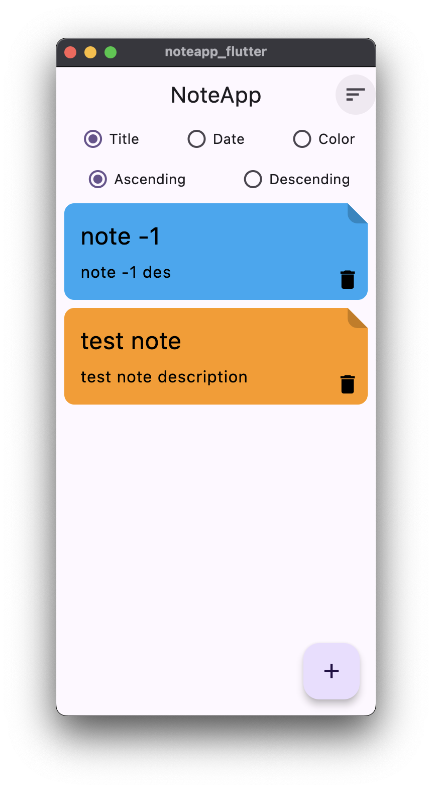
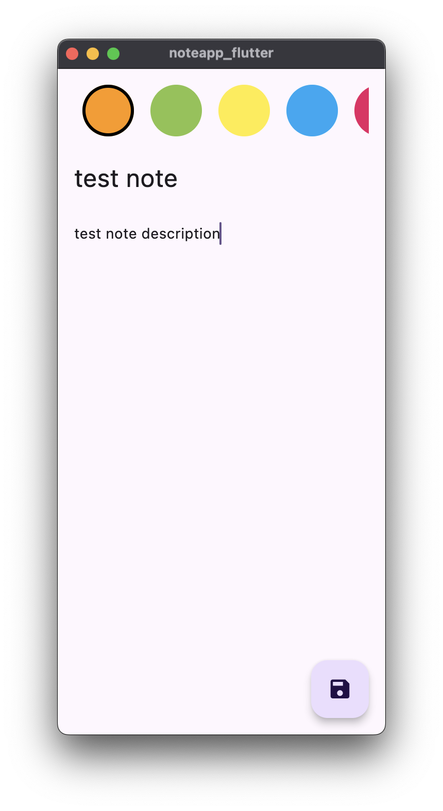

# NoteApp.Flutter

## 1. Project Summary

**NoteApp.Flutter** is a simple yet efficient note-taking application built using Flutter. The app allows users to create, update, and delete notes while leveraging SQLDelight for persistent local storage. Designed with a clean architecture, the app ensures ease of maintenance and scalability.

## 2. Features

- **Add, Edit, and Delete Notes**: Manage notes with ease.
- **Local Storage**: Utilizes SQLDelight for storing notes locally.
- **User-friendly UI**: Designed with Flutter’s modern UI components.
- **Dark/Light Mode**: Supports both themes for a better user experience.
- **Responsive Layout**: Ensures an optimized experience across various devices.

## 3. Technology Used

- **Flutter**: The main framework for the app.
- **SQLDelight**: For local persistent data storage.
- **Provider**: For state management in Flutter.
- **Dart**: The programming language used in Flutter.

## 4. Screenshots

| Note List Screen | Add Note Screen |
| ------------ | ------------ |
|  |  |

### Project Structure

- **Data Layer**: Handles the SQLDelight configuration for local storage.
- **Domain Layer**: Contains the core logic for note management.
- **Presentation Layer**: Manages the UI, built with Flutter widgets.

## 5. Contributing

Contributions are welcome! If you find a bug or want to add new features, feel free to open an issue or submit a pull request.

## 6. License

This project is licensed under the MIT License. See the [LICENSE](/LICENSE) file for details.
